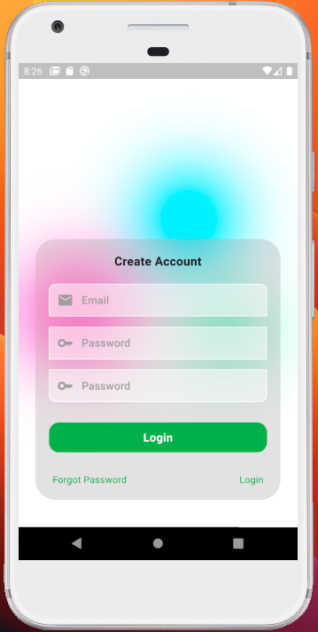

# animated_auth_preparation

A flutter code that contain of authentication services such as login, registration and forgot password.
the special things of this example is i create thoose serive with just i page. not three.
as you can see on screenshoot each service stand is same page, when user click login button
the application will swipped to login container, also when user click registration button
the application with swipped to registration container.

## Screenhsoot

